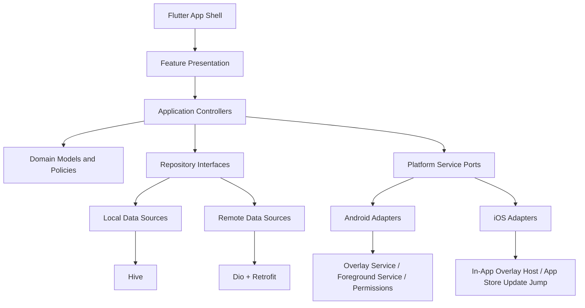

# Flutter 重构技术架构图

## 1. 项目目标

- 旧 Android 原生工程保持只读，不做原地翻修。
- 新工程统一放在 `Flutter_Project/`，后续 Flutter 代码、文档、测试全部在这里推进。
- 目标不是“Java 到 Dart 的逐文件翻译”，而是“共享核心业务 + 平台差异适配”的全新重构。
- 主目标平台是 iOS，但必须先承认能力边界：iOS 不支持像 Android `SYSTEM_ALERT_WINDOW` 那样对其他 App 做系统级悬浮覆盖。

## 2. 能力边界与产品形态

| 能力 | Android | iOS | 架构策略 |
| --- | --- | --- | --- |
| 设置页、使用说明页 | 支持 | 支持 | 纯 Flutter 共享 |
| 遮挡层尺寸/位置/吸边/透明切换逻辑 | 支持 | 支持 | 纯 Dart 共享 |
| 系统级悬浮层覆盖第三方 App | 支持 | 不支持 | Android 平台特化 |
| 应用内预览遮挡层 | 支持 | 支持 | 纯 Flutter 共享 |
| 常驻前台服务保活 | 支持 | 不支持 | Android 平台特化 |
| 剪贴板导入导出 | 支持 | 支持 | Flutter + 平台插件 |
| 更新检查 | 支持 | 支持 | 共享网络层 |
| APK 下载并安装 | 支持 | 不支持 | Android 平台特化 |
| App Store / TestFlight 跳转更新 | 可选 | 支持 | iOS 平台特化 |

结论：

- Android 保留“全局悬浮模式”。
- iOS 主形态改为“应用内遮挡层模式”，例如视频预览页、校准页、遮挡层编辑页。
- 跨平台共享的是领域逻辑和大部分设置/界面，而不是强行追求系统悬浮层完全一致。

## 3. 技术栈选型

| 类别 | 选型 | 选择原因 |
| --- | --- | --- |
| 状态管理 | `Riverpod` | 比 `Provider` 更适合大型重构，天然支持测试、作用域、依赖声明，适合 AI 生成规范化代码 |
| 状态代码生成 | `riverpod_annotation` + `freezed` | 统一生成 provider、不可变状态、拷贝方法和联合类型 |
| 网络请求 | `Dio` | 成熟、可拦截、可测试、错误模型清晰 |
| API 客户端生成 | `retrofit` | 基于 `Dio` 生成 API 调用壳，减少 AI 手写样板代码 |
| 本地存储 | `Hive` | 当前业务以设置、布局状态、版本忽略记录为主，KV 模型更贴近场景 |
| 依赖注入 | `get_it` + `injectable` | 工程化成熟，便于 AI 生成统一的装配代码 |
| 路由 | `go_router` | 支持声明式路由和深链接 |
| 国际化 | `flutter_localizations` + `intl` | 对应旧项目的多语言需求 |
| 平台桥接 | `Pigeon` | 生成强类型平台通道，减少 Android/iOS 桥接歧义 |
| 权限与系统能力 | `permission_handler`、`package_info_plus`、`url_launcher`、`share_plus` | 对应权限、版本、跳转、分享/剪贴板周边能力 |

## 4. 目标分层



分层职责：

- `presentation`：页面、组件、交互状态订阅，不写业务判断。
- `application`：Riverpod controller/notifier，负责编排事件、状态变更、一次性命令。
- `domain`：不可变状态、约束规则、比较器、导入导出协议、失败模型。
- `infrastructure`：Hive、Dio、Retrofit、Pigeon、平台服务实现。

## 5. 目标目录结构

```text
Flutter_Project/
  docs/
  lib/
    app/
      app.dart
      router/
      theme/
    core/
      di/
      error/
      platform/
      logging/
      contracts/
    features/
      settings/
        presentation/
        application/
        domain/
        infrastructure/
      overlay/
        presentation/
        application/
        domain/
        infrastructure/
      usage/
      updates/
      config_transfer/
      onboarding/
    shared/
      widgets/
      models/
      utils/
```

## 6. 页面结构设计

### 6.1 Flutter 顶层路由

- `/home`：设置首页，对应旧 `MainActivity`
- `/usage`：使用说明页，对应旧 `UsageActivity`
- `/overlay-preview`：共享的遮挡层预览/校准页
- `/onboarding/permissions`：Android 权限引导页
- `/debug/contracts`：仅开发环境使用的行为合同核对页

### 6.2 页面组织原则

- 采用单 `MaterialApp.router` + 多 route page，不保留 Android 的多 Activity 心智。
- 原生 Fragment 在 Flutter 中优先转成“页面 section widget”、“底部弹层”或“对话框”，而不是强行对应成独立 route。
- 旧项目没有 Fragment，因此 Flutter 首版不需要引入嵌套导航来模拟 Fragment。

## 7. 原生到 Flutter 的架构映射

| 原生元素 | Flutter 对应物 | 说明 |
| --- | --- | --- |
| `MainActivity` | `SettingsHomePage` | 承载设置、导入导出、更新检查、导航入口 |
| `UsageActivity` | `UsageGuidePage` | 纯文档型页面 |
| `OverlayWindowView` | `OverlayCanvas` + `OverlayGestureLayer` | 共享 Widget，负责绘制遮挡层与手势 |
| `OverlayRuntime` | `OverlayRuntimeCoordinator` | 负责把共享状态同步到 Android/iOS 宿主 |
| `OverlayViewBinder` | `OverlayScenePresenter` | 把状态绑定到 Widget/平台宿主 |
| `OverlayViewModel` | `OverlaySessionController` | Riverpod `Notifier` 或 `AsyncNotifier` |
| `SharedPreferencesSettingsRepository` | `SettingsRepositoryImpl` + `HiveSettingsDataSource` | 本地存储改为 Hive |
| `GithubReleaseClient` | `ReleaseRemoteDataSource` | `Dio + Retrofit` |
| `KeepAliveService`/`KeepAliveController` | `AndroidKeepAliveAdapter` | Android 独有 |
| `PermissionNavigator` | `PermissionService` | Android/iOS 分平台实现 |

## 8. UI 组件映射协议

| 原生 XML 模式 | Flutter 写法 |
| --- | --- |
| `ScrollView + LinearLayout` | `CustomScrollView` / `ListView` + `Column` |
| `MaterialCardView` | `Card` / `Container` + 统一 design tokens |
| `TextView` | `Text` |
| `MaterialButton` | `FilledButton` / `OutlinedButton` / `TextButton` |
| `RadioGroup + RadioButton` | `SegmentedButton` / `RadioListTile` |
| `SwitchMaterial` | `SwitchListTile.adaptive` |
| `EditText` | `TextFormField` |
| `SeekBar` | `Slider` |
| `FrameLayout` 叠层 | `Stack` + `Positioned` |
| 拖拽/缩放 handle | `GestureDetector` / `Listener` / `MouseRegion` |
| View 显隐 | 条件渲染或 `AnimatedOpacity` / `AnimatedSwitcher` |

原则：

- 按“交互语义”迁移，不按 XML 节点一比一搬运。
- 尽量提炼复用组件，例如 `SettingsSectionCard`、`ToggleField`、`OverlayHandle`。
- Android 和 iOS 共用 Widget 树，平台差异只放在 adapter/service 层。

## 9. 关键控制器设计

### 9.1 `OverlaySessionController`

职责：

- 管理遮挡层可见性、位置、大小、透明模式、最小化状态
- 处理拖拽、缩放、吸边、自动恢复计时
- 下发一次性 UI 命令，如权限引导、播放提示音、淡出后隐藏

### 9.2 `SettingsController`

职责：

- 管理关闭按钮位置、声音开关、语言、保活开关、最小化光点大小、旋转动画开关
- 加载并持久化 Hive 设置

### 9.3 `UpdateController`

职责：

- 查询最新版本
- 判断忽略版本规则
- Android 下发 APK 下载/安装命令
- iOS 下发 App Store/TestFlight 跳转命令

## 10. 平台适配器

### 10.1 Android

- `AndroidOverlayHostAdapter`
- `AndroidPermissionAdapter`
- `AndroidKeepAliveAdapter`
- `AndroidUpdateInstallerAdapter`

这些适配器负责：

- 悬浮窗权限
- 前台服务
- 系统级窗口显示与隐藏
- APK 下载与安装

### 10.2 iOS

- `IosInAppOverlayAdapter`
- `IosUpdateLauncherAdapter`
- `IosPermissionAdapter`

这些适配器负责：

- 在应用内页面中承载遮挡层
- 跳转 App Store 或 TestFlight
- 对应 iOS 权限请求

## 11. 迁移阶段

### Phase 0

- 建立 `Flutter_Project`
- 固化行为合同、功能库存、常量表

### Phase 1

- 先迁移纯领域逻辑：`OverlayState`、`Settings`、约束规则、版本比较器
- 使用 Dart 单元测试对齐旧测试

### Phase 2

- 完成 Flutter 设置页、使用页、预览遮挡层
- 实现 Hive、本地化、导入导出

### Phase 3

- 接入 Android 平台适配器，实现全局悬浮层与保活

### Phase 4

- 完成 iOS 应用内遮挡模式
- 补齐平台更新跳转逻辑

### Phase 5

- 做回归、对照测试、边界条件补漏
- 以 `LEGACY_FEATURE_INVENTORY.md` 为核对清单验收

## 12. 架构落地原则

- 所有业务规则先进入 `domain` 或 `application`，禁止直接写在 Widget 事件回调里。
- 每个 Flutter feature 都必须能追溯到旧原生 feature inventory。
- 平台差异采用 `Platform Service Port + Adapter`，禁止业务层直接 import 平台实现。
- 任何“iOS 无法实现的旧能力”必须在文档中显式标红说明，不允许默默删除。
