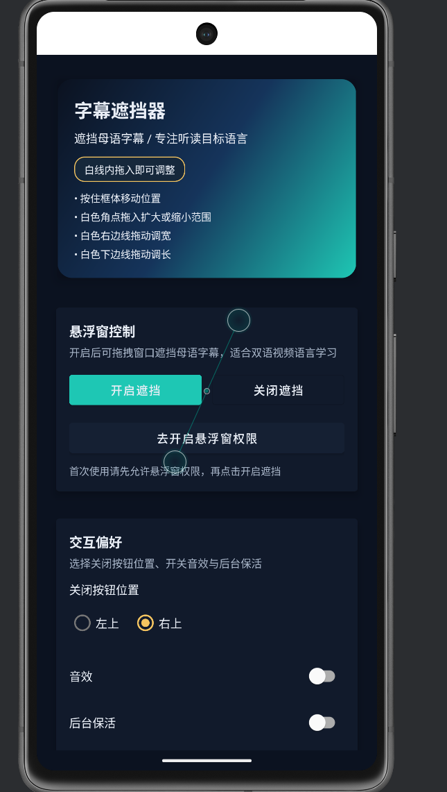
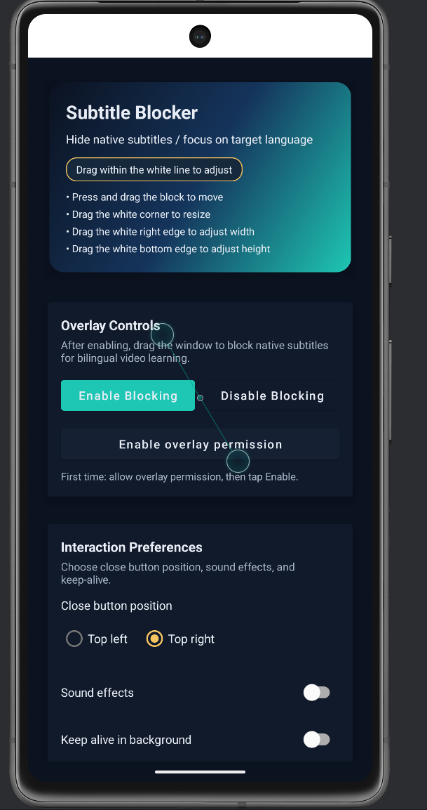

# 字幕遮挡器

## 项目简介

字幕遮挡器是一款为安卓设备打造的悬浮遮挡工具，让你在任意播放器上快速盖住字幕或屏幕上不想看到的区域，从而专注画面或练习听力。

## 主要特性

- 可拖动、吸附边缘的遮挡层：长按拖拽移动，松手自动吸附屏幕边缘，避免挡住内容。
- 多种尺寸调节：右下角手柄双向缩放，单独右侧/底部手柄做水平或垂直拉伸，支持最小尺寸约束。
- 透明/不透明一键切换：点按遮挡层或透明按钮在两种模式间切换，支持自动恢复不透明（1–60 秒可配）。
- 关闭按钮位置可选：可选左上或右上圆形关闭键，便捷隐藏遮挡器。
- 声音与常驻服务：切换声效提示，可选前台常驻通知（需通知权限）保证悬浮窗持久运行。
- 配置导入导出：一键复制当前配置到剪贴板（JSON），或从剪贴板粘贴导入，方便分享与迁移。
- 多语言界面：跟随系统或手动选择中文、English、Français、Español、Русский、العربية。

## 使用指南

1) 打开应用并授予悬浮窗权限，必要时开启通知权限以启用常驻服务。
2) 在主界面配置：关闭键位置、提示音、常驻服务、透明切换及自动恢复时长、界面语言。
3) 点击 “启用” 显示遮挡器；拖动到字幕区域，使用手柄调节大小/比例。
4) 轻点遮挡层或透明按钮切换透明/不透明；启用自动恢复后会按设定秒数恢复不透明。
5) 点击圆形关闭键或在设置页点 “禁用” 隐藏遮挡器。
6) 导出/导入配置：主界面一键复制当前 JSON，或从剪贴板粘贴并应用，便于多设备同步。

## 截图
 

## 技术栈

- Java 8，AndroidX AppCompat 与 Material 组件。
- 悬浮窗实现基于 FloatingX 2.3.7。
- LiveData/ViewModel 管理悬浮窗状态与动画。
- 目标/编译 SDK 34，最小 SDK 21，应用 ID: com.zimuzhedang.subtitleblocker。

## 权限

- SYSTEM_ALERT_WINDOW 悬浮窗权限：显示遮挡器必须授权。
- FOREGROUND_SERVICE* 前台服务权限：保持后台常驻时使用。
- POST_NOTIFICATIONS 通知权限：启用常驻通知时申请。

## 环境要求

- JDK 8+，Android SDK 21+，Android Gradle Plugin 8.13.0。
- 推荐使用 Android Studio Iguana+，或命令行 Gradle Wrapper。

## 快速开始

```bash
./gradlew assembleRelease
```

- 产物位置：app/build/outputs/apk/release/
- Windows 可执行 gradlew.bat assembleRelease；也可在 VS Code 任务面板运行 “Assemble Release APK”。


## 配置项速查

- 关闭按钮位置：左上 / 右上。
- 提示音：开关，操作时播放提示音。
- 常驻服务：开启后显示前台通知，降低被系统回收概率。
- 透明切换：允许点按遮挡层切换透明；可设自动恢复秒数。
- 自动恢复：1–60 秒，透明模式下倒计时自动回到不透明。
- 语言：跟随系统或手动选择多语言。

## 目录概览

- app/ 源码与资源（悬浮窗逻辑、前台服务、设置页 UI）。
- build.gradle（项目级）与 app/build.gradle（模块级配置）。
- gradle/ 与 gradlew*（Gradle 包装器）。

## 贡献

欢迎提交 Issue 或 PR，改进功能、体验或本地化。

## 许可证

MIT License（见仓库 LICENSE）。

---

# Subtitle Blocker

## Overview

Subtitle Blocker is a floating overlay tool for Android that lets you quickly cover subtitles or any on-screen area so you can focus on visuals or practice listening.

## Key Features

- Draggable, edge-snapping blocker: long-press to drag; it snaps to screen edges to avoid covering content.
- Flexible resizing: corner handle for two-axis scaling; side/bottom handles for horizontal/vertical stretching with minimum size constraints.
- One-tap transparency toggle: tap the layer or transparency button to switch modes; optional auto-restore to opaque in 1–60 seconds.
- Configurable close button: choose top-left or top-right round close button.
- Sound and keep-alive: optional click sound; foreground service (with notification permission) to keep the overlay alive.
- Import/Export settings: copy current JSON config to clipboard or paste to restore—easy sharing across devices.
- Multi-language UI: follow system or pick Chinese, English, French, Spanish, Russian, or Arabic.

## Tech Stack

- Java 8, AndroidX AppCompat + Material components.
- Floating overlay powered by FloatingX 2.3.7.
- LiveData/ViewModel for state and animations.
- Target/compile SDK 34, min SDK 21, applicationId: com.zimuzhedang.subtitleblocker.

## Permissions

- SYSTEM_ALERT_WINDOW: required to show the overlay.
- FOREGROUND_SERVICE*: used to keep the service alive in foreground.
- POST_NOTIFICATIONS: requested when enabling the foreground notification.

## Requirements

- JDK 8+, Android SDK 21+, Android Gradle Plugin 8.13.0.
- Android Studio Iguana+ recommended, or Gradle Wrapper via CLI.

## Quick Start

```bash
./gradlew assembleRelease
```

- Output: app/build/outputs/apk/release/
- On Windows, run gradlew.bat assembleRelease, or use the VS Code task “Assemble Release APK”.

## Usage

1) Open the app and grant overlay permission; allow notifications if you need the keep-alive service.
2) Configure: close-button side, click sound, keep-alive notification, transparency toggle with auto-restore seconds, UI language.
3) Tap “Enable” to show the blocker; drag it over subtitles and resize via corner/edge handles.
4) Tap the layer or transparency button to toggle modes; with auto-restore enabled, it returns to opaque after the set delay.
5) Hide via the round close button or the “Disable” action in settings.
6) Export/import via clipboard JSON for quick sharing across devices.

## Settings Cheat Sheet

- Close Button Position: top-left / top-right.
- Click Sound: on/off for operation feedback.
- Keep Alive: foreground notification to reduce system kill risk.
- Transparency Toggle: allow tap-to-toggle; optional auto-restore seconds.
- Auto Restore: 1–60 seconds; returns to opaque after delay.
- Language: follow system or pick from bundled languages.

## Project Layout

- app/: source and resources (overlay logic, foreground service, settings UI).
- build.gradle (project) and app/build.gradle (module config).
- gradle/ and gradlew* (Gradle Wrapper).

## Contributing

Issues and PRs are welcome for fixes, features, and localization improvements.

## License

MIT License (see LICENSE in repo).
